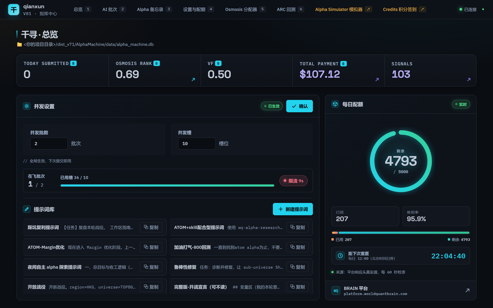
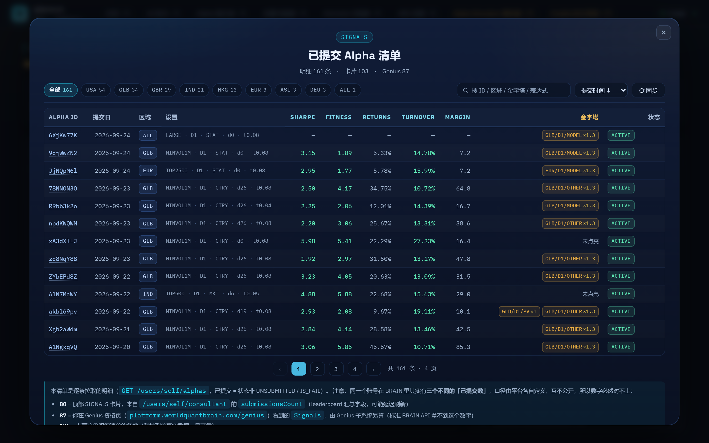
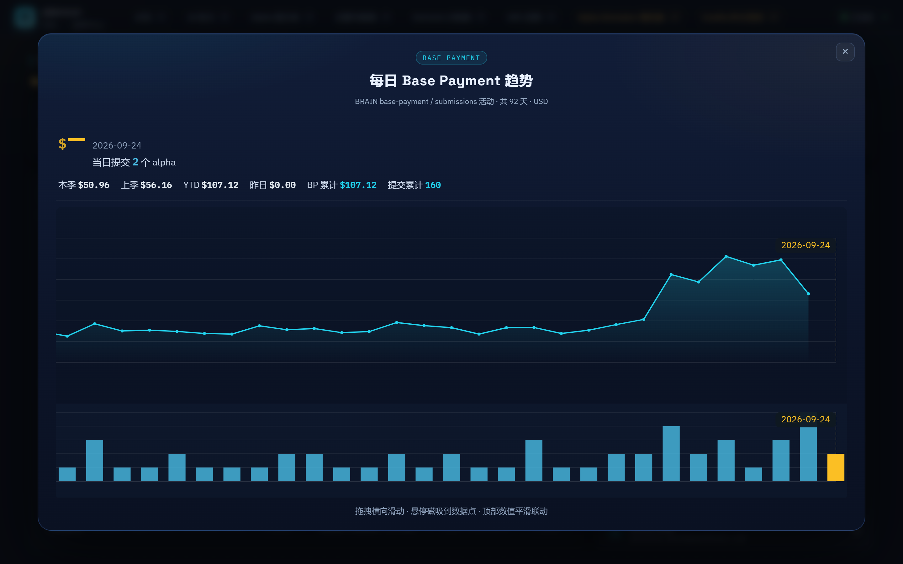
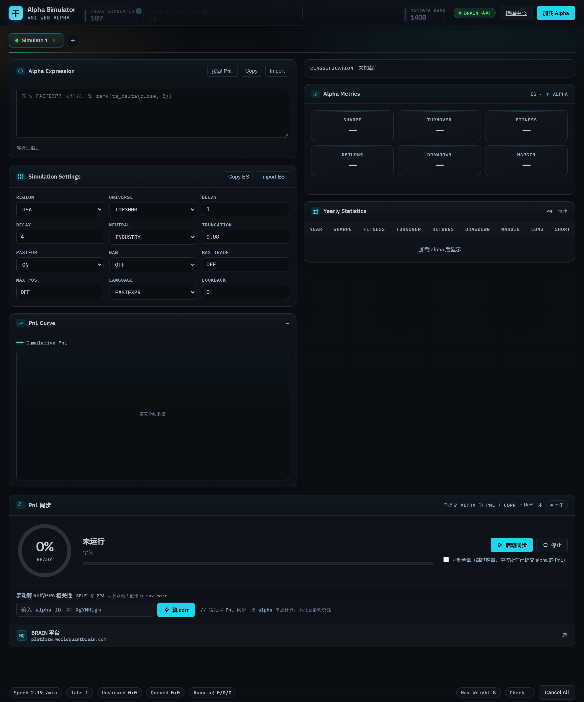
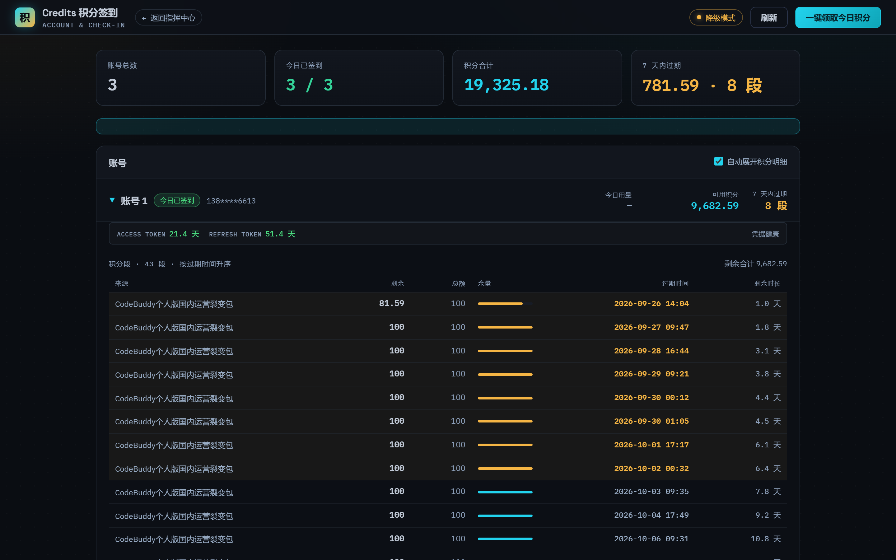

# 千寻 web 引擎 · qianxun-web-engine

> WorldQuant BRAIN alpha 批量挖掘的 **Web 指挥中心**：表达式生成 → 批量回测 → 指标分析 → 提交，全流程可视化。

本仓库是「千寻 / AlphaMachine」项目的 **web 引擎部分**，只包含 Web 指挥中心运行所需的代码。
桌面端（PySide6 GUI、表达式工厂、CLI 流水线）不在本仓库内，见文末[与桌面端的关系](#与桌面端的关系)。

| 页面 | 地址 | 作用 |
|---|---|---|
| 指挥中心 | `/` | 批次管理、并发调度、实时进度、配额、Osmosis 分配、ARC 回测 |
| Alpha Simulator | `/simulator` | 单 alpha 的表达式与设置、IS 指标、年度统计、PnL 曲线、PnL 同步 |
| Credits 积分签到 | `/credits` | WorkDaddy 账号积分查询与每日签到（**依赖外部程序**，见下） |



## 快速开始

### 1. 环境要求

- Python **3.10+**（实测 3.13）
- 一个 WorldQuant BRAIN 账号
- 平台：除 `/credits` 页外不依赖 Windows 特有 API —— 全仓库只有 `wq_web/workdaddy_proxy.py`
  用到了 Windows 路径（`%APPDATA%`）。也就是说 **Linux / macOS 上除了积分签到页，其余功能可正常跑**。

### 2. 安装

```bash
git clone https://github.com/onefreecomet/qianxun-web-engine.git
cd qianxun-web-engine
python -m venv .venv
source .venv/bin/activate        # Windows: .venv\Scripts\activate
pip install -r requirements.txt
```

### 3. 配置 BRAIN 凭据（二选一）

**方式一 · 环境变量**（最简单）

```bash
export WQ_USERNAME="your@email.com"      # Windows: set WQ_USERNAME=...
export WQ_PASSWORD="your_password"
```

**方式二 · 系统 keyring**（不落明文，推荐长期使用）

```python
import keyring
keyring.set_password("alpha-machine", "your@email.com", "your_password")
```

> 凭据读取顺序：环境变量优先，回退 keyring（service = `alpha-machine`）。
> 代码里不会出现任何明文凭据，也不会把凭据写进日志。

### 4. 启动

```bash
python run_web.py                  # 默认 8090
python run_web.py --port 9000      # 换端口
QW_PORT=9000 python run_web.py     # 或用环境变量
```

浏览器打开 **http://127.0.0.1:8090**。

**桌面窗口模式**（可选，套一层原生窗口，不想要浏览器标签页时用）

```bash
pip install pywebview              # requirements.txt 里是注释状态，按需安装
python run_native.py
```

## 三个页面

### 指挥中心 `/`


- **总览指标**：今日已提交、Osmosis Rank、Value Factor、累计 Base Payment、Signals
- **AI 批次**：提交批次、实时进度、单条模拟明细、断点续跑
- **设置与配额**：并发批数 / 并发槽配置、提示词库、每日回测配额仪表
- **Alpha 备忘录**：按主题分组的 alpha 记录与备注
- **Osmosis 分配器**：按渗透分规划分配方案
- **ARC 回测**：Region-Agnostic 投递与结果查看

弹窗入口：**已提交 Alpha 清单**（支持排序 / 区域筛选 / 搜索 / 分页）、
**每日 Base Payment 趋势**、**日渗透分变化趋势**。




### Alpha Simulator `/simulator`



- 多标签页，每个标签独立加载一个 alpha
- 表达式与 Simulation Settings 编辑（支持 Copy / Import）
- **IS 指标**：Sharpe / Turnover / Fitness / Returns / Drawdown / Margin，含按区域拆分的指标行
- **Yearly Statistics**：按年拆分的指标表
- **PnL 曲线**：本地绘制，支持「拉取 PnL」按需取数
- **PnL 同步**：批量同步已提交 alpha 的 PnL 到本地库、手动计算 Self / PPA 相关性

### Credits 积分签到 `/credits`



> ⚠️ **这一页不是纯网页功能，它依赖本机安装过 WorkDaddy 桌面客户端。**
> 没装的话该页拿不到数据（但**页面仍能打开，其余页面完全不受影响**）。

- 读出 WorkDaddy 里**已登录的账号**，展示积分余额、过期时间、今日用量
- 一键批量领取每日签到积分
- 两条取数通道：

| | 主通道 | 降级通道 |
|---|---|---|
| 触发条件 | WorkDaddy 客户端**正在运行** | 客户端**装过但没运行** |
| 取数方式 | 转发 WorkDaddy daemon 本地 API（`x-workdaddy-token` 认证） | 读 `accounts/*.info` 里的 `accessToken`，直连官方接口 |
| 页面状态 | 绿点 `已连接 · N 账号 · :端口` | 黄点 `降级模式` |
| 代价 | 无 | **今日用量不可用**；token 过期须回客户端续期 |

两条通道都要求存在这个目录（Windows）：

```
%APPDATA%\WorkDaddy\
├── accounts\*.info      # 账号与登录凭据 —— 两条通道都要读
├── .api-token           # 主通道：daemon 本地 API 令牌
└── ui-port.json         # 主通道：daemon 监听端口
```

**最小要求是「WorkDaddy 装过、且至少登录过一个账号」**；想要完整功能（含今日用量）
则需要客户端正在运行。

**已知限制**

- **仅 Windows**：数据目录定位写死了 `%APPDATA%\WorkDaddy` 与 `~/AppData/Roaming/WorkDaddy`
  （见 `wq_web/workdaddy_proxy.py` 的 `_candidate_data_dirs()`），macOS / Linux 上该页不可用
- **需能直连官方接口**：降级通道会访问 `www.workbuddy.cn`、`www.codebuddy.cn` 等域名
- **不自动续期 token**：过期只报「登录身份过期」，需回 WorkDaddy 重新登录。
  这是**刻意**的 —— 刷新 token 要 POST 官方 auth 接口并回写 `.info`，属于越界操作
- **不写 WorkDaddy 任何状态**：只读它的配置，不改账号状态、不写它的签到缓存。
  降级通道无每日缓存，重复点「领取」会重复打接口（官方对已签到返回 `10001 今天已签到`，幂等安全）

**安全说明**：access token **只在进程内存里拼请求头**，不落盘、不打印、不写日志。

**排障**（页面状态由 `GET /api/xgj/health` 的字段决定）

| 页面显示 | 接口信号 | 原因 | 处理 |
|---|---|---|---|
| 红条「未连接」+ `未找到 WorkDaddy 数据目录` | `dataDir: null`、`degradedUsable: false` | 没装 WorkDaddy，或装在非默认位置 | 安装并登录 WorkDaddy |
| 红条「未连接」+ 其他 daemon 错误 | `degradedUsable: false` | 装过但没运行，且无可用账号备份 | 启动 WorkDaddy |
| 黄点「降级模式」 | `degradedUsable: true`、`backupCount: N` | 客户端没运行，走直连通道 | 想要「今日用量」就启动客户端 |
| 某账号「登录身份过期」 | — | 该账号 token 过期 | 回 WorkDaddy 重新登录该账号 |

```bash
curl http://127.0.0.1:8090/api/xgj/health    # 只读自查
```

## 对接 AI Agent（MCP，可选）

内置 MCP Server，可让支持 MCP 的 Agent 直接驱动挖掘流程：

```bash
python run_mcp.py                                        # stdio（推荐给桌面 Agent）
python run_mcp.py --transport sse                        # SSE，供远程调试
python run_mcp.py --transport streamable-http --port 8765
```

| 工具 | 作用 |
|---|---|
| `qianxun_login` | 登录测试，返回账号标识（凭据：环境变量优先，回退 keyring） |
| `qianxun_submit` | 提交一批表达式回测（入参是 `{settings, expressions[]}` 格式的 JSON 路径） |
| `qianxun_status` | 查批次状态；不传批次号则列最近 10 条 |
| `qianxun_wait` | 等批次完成（轮询 `ai_batches.status`，默认超时 3600 秒） |
| `qianxun_analyze` | 读库输出批次结果（按 \|sharpe\| 降序，返回 markdown 表格） |
| `qianxun_radar` | 方向雷达四色信号（GREEN / YELLOW / RED / DEAD + DSI + 护栏 + 建议） |
| `qianxun_resume` | 断点续跑：按批次号找回 task_run，补跑 pending 的模拟 |

## 数据与存储

所有任务、模拟、alpha 指标、PnL、备忘录都存在一个 SQLite 库里。

**数据库定位顺序**（见 `wq_engine/mcp_server.py` 的 `_latest_db()`）：

1. 环境变量 `QIANXUN_DB` 指定的路径（存在即用）
2. 项目根与当前工作目录向上 5 级内，找 **编号最大** 的 `dist_v*/AlphaMachine/data/alpha_machine.db`
3. 都找不到 → 回退到 `<项目根>/data/alpha_machine.db`，**自动建空库**

> **新环境首次启动是空库，这是预期行为。** 界面能正常打开，但批次列表、备忘录、
> PnL 曲线、Signals 清单、配额历史都是空的 —— 数据不会随代码一起发布。
> 要把旧数据带过去，把 `alpha_machine.db` 拷到上面任一路径，或直接设 `QIANXUN_DB`。

## 目录结构

```
qianxun-web-engine/
├── run_web.py              # Web 入口（uvicorn，默认 8090）
├── run_native.py           # 桌面窗口模式入口（pywebview，可选）
├── run_mcp.py              # MCP Server 入口（stdio / sse / http）
├── requirements.txt
├── wq_web/                 # Web 层
│   ├── server.py           # FastAPI 应用：页面路由 + 全部 REST API
│   ├── workdaddy_proxy.py  # 积分签到：WorkDaddy 代理 + 官方接口直连
│   ├── run_web.py          # 备用启动脚本（读 QW_PORT）
│   ├── templates/          # 三个页面：index / simulator / credits
│   └── static/             # 对应三套 css + js
├── wq_engine/              # 引擎层（web 用到的部分）
│   ├── api/                # BRAIN REST 客户端、本地相关性算法、corr 池
│   ├── arc/                # ARC（Region-Agnostic）回测
│   ├── osmosis/            # Osmosis 分配方案
│   ├── scheduler/          # 并发调度、SUPER 通道、RA 公共逻辑
│   ├── storage/            # SQLite 持久化
│   ├── sync/               # PnL 同步
│   └── mcp_server.py       # MCP 工具定义
└── docs/screenshots/       # README 用的界面截图
```

## 外部依赖一览

| 功能 | 依赖 | 缺失后果 |
|---|---|---|
| 页面打开、界面渲染 | 无（只要 Python 依赖装齐） | — |
| 全部 BRAIN 功能 | BRAIN 账号凭据（环境变量或 keyring） | 数据拉不到；页面能开 |
| Credits 积分签到 | 本机 WorkDaddy 桌面客户端（Windows） | **仅该页**数据不可用，其余页面不受影响 |
| 桌面窗口模式 | `pywebview`（可选安装） | 只能浏览器访问 |
| PnL 同步 / 相关性计算 | 无额外依赖（本地算法） | — |

## 排障

| 现象 | 原因 | 处理 |
|---|---|---|
| 页面能开但所有列表为空 | 空库（新环境正常） | 见上文[数据与存储](#数据与存储) |
| `Address already in use` | 8090 被占用 | 换端口：`python run_web.py --port 9000` |
| 数据拉不到、指标全是 `—` | 凭据未配置或失效 | 检查 `WQ_USERNAME` / `WQ_PASSWORD` 或 keyring |
| 改了前端但页面没变 | 浏览器缓存 | 静态资源带 mtime 版本号会自动失效，强制刷新即可 |
| 接口首次响应很慢 | 部分接口要实时打 BRAIN | 属正常，非故障 |
| 积分页显示「未连接」 | 见上文积分页排障表 | 见上文 |

## 与桌面端的关系

本仓库是**纯 web 引擎**，只保留 Web 指挥中心运行所需的模块。
以下桌面端模块**刻意不在本仓库内**：

`wq_engine/ui/`（PySide6 界面）、`wq_engine/cli.py`、`wq_engine/factories/`（表达式工厂）、
`wq_engine/inspiration/`（灵感/表达式构建）、`wq_engine/scoring.py`（推荐评分）、
`wq_engine/dedup.py`（表达式去重）、`wq_engine/report.py`（报告导出）、
`wq_engine/settings_registry.py` 等。

因此：**本仓库能跑起完整的 Web 界面与回测调度，但跑不起桌面 GUI，也没有 CLI 流水线。**

## 更新记录

| 日期 | 内容 |
|---|---|
| 2026-09-25 | 修复克隆后无法启动（`server.py` 顶层导入改为包内导入）；补回缺失的 `corr_pool.py`；README 重写 |
| 2026-09-24 | 每日配额改为指挥中心内的独立仪表卡；PnL 同步整卡迁至 Alpha Simulator 页 |
| 2026-09-23 | 同步 v82 / v83 源码（Quick 初筛、SUPER 通道、升级复验、提交保护、RA 原生内建） |
| 2026-09-16 | Alpha Simulator 页面 + Osmosis 历史快照 |
| 2026-09-06 | 移出 web 用不到的引擎模块，还原纯 web 引擎定位 |
| 2026-09-05 | 同步千寻 web v81 源码 |
| 2026-08-31 | Osmosis 动态赛道列表、只分配有补偿的 alpha |

## 许可

[MIT](LICENSE) © 2026 onefreecomet
